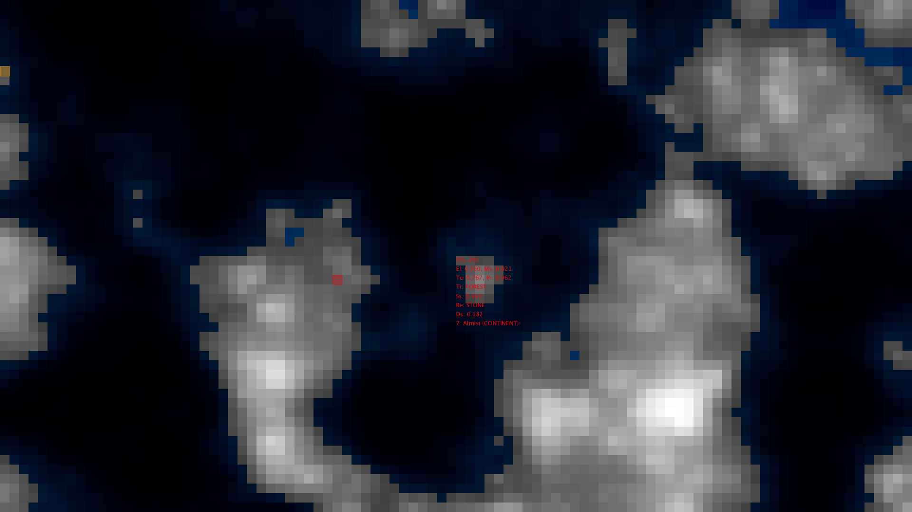
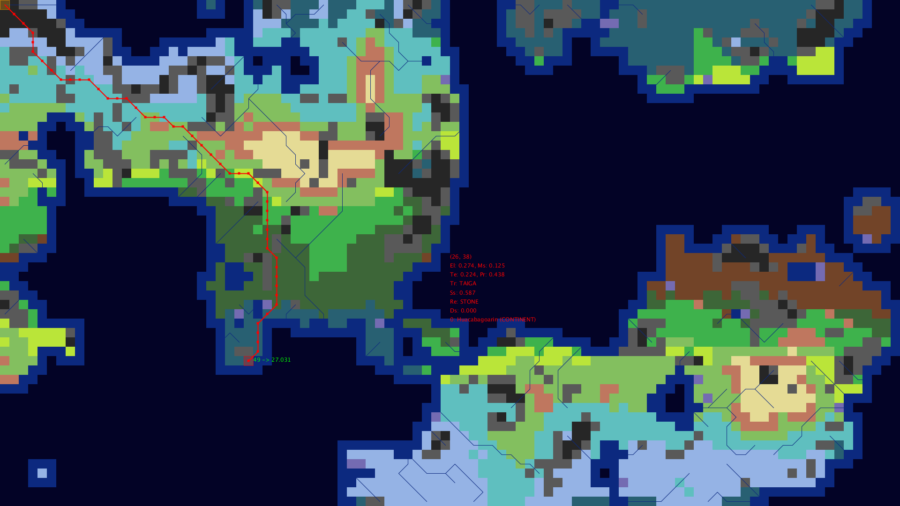

# squares

This is a procedural fantasy map generator using the [Processing](https://processing.org/) graphical library for Java.

I came across this [Daniel Shiffman](https://www.youtube.com/watch?v=IKB1hWWedMk) video, which introduced me to both Processing and Perlin noise. This is the noise algorithm used to procedurally generate terrain in games such as Minecraft, which inspired me to make this project. A large portion of my research came from these articles: [1](http://www-cs-students.stanford.edu/~amitp/game-programming/polygon-map-generation/), [2](https://azgaar.wordpress.com/2017/06/30/biomes-generation-and-rendering/). I initially considered using Voronoi tessellation as well, but eventually settled on a square tilemap because i like the simplicity and the aesthetics.

I have ported this project to Unity, so I don't plan to expand it here.

## Features

I use Perlin noise to generate the height map which, when combined with a sea level threshold, determines landmass edges and rivers.

A very primitive simulation of temperature and precipitation (using height, latitude and proximity to water as factors) yields the terrain.

Resource generation is determined by a system of scripted weights using probability rules.

Settlement placement is determined taking into account terrain, proximity to water and isolation from other settlements. 

You can scroll through all these map modes using the 'A' and 'D' keys. You can also enable grid mode using the 'G' key.

I originally intended this project to be the basis for some kind of strategy game, so I also implemented very basic unit movement alongside Dijkstra-based pathfinding. The app spawns a unit which you can move around using the arrow keys or place using your mouse (inside the same landmass though).

Finally, settlements, rivers and landmasses / watermasses are assigned names from [this name pool](assets/names.txt). It consists of names produced by [this procedural name generator](https://www.samcodes.co.uk/project/markov-namegen/), which I trained using a dataset of real life topographic names.

## Running

This is a Java 8 project in Eclipse which requires Processing 3 in its build path. I included a stand-alone [.jar file](squares.jar) which you can run right away if you have Java installed.

## Screenshots

The elevation map mode, where white represents the maximum height and dark grey is sea level. Inland blue patches (including the one in the upper-right corner) are lakes.

\

The terrain map mode, including a pathfinding trace. Notice how, to get the unit at (0, 0) to the tip of the peninsula at (26, 38), the pathfinding algorithm avoids crossing rivers (the thin blue lines) and hilly terrain (both shades of gray).
